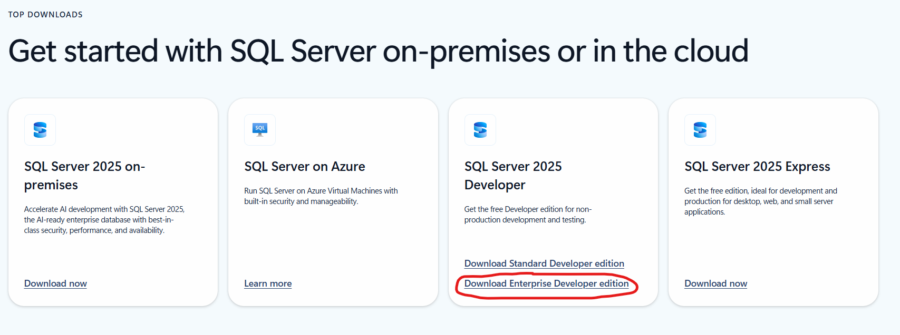
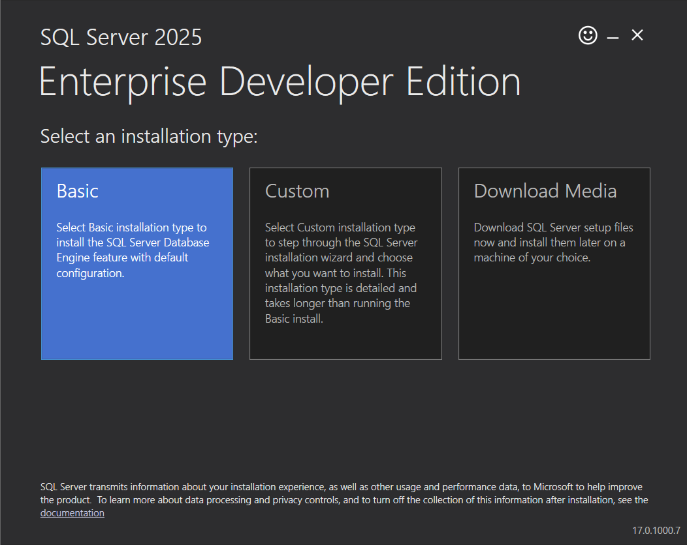
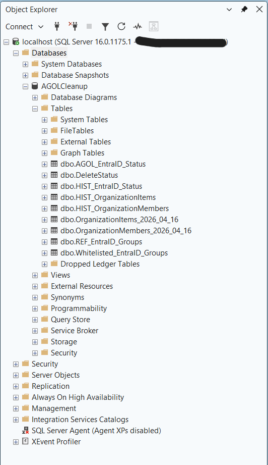
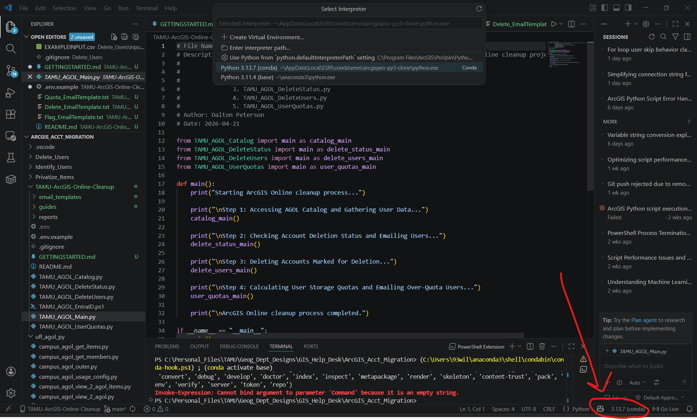
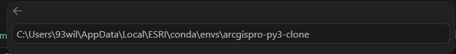
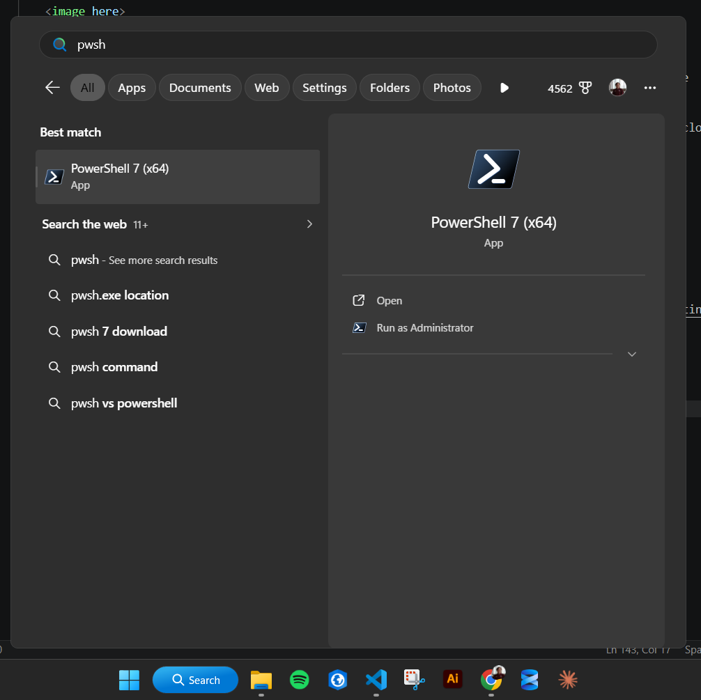

# Getting started - Texas A&M ArcGIS Online (AGOL) Cleanup

Author: Dalton Peterson - GIST '26
Texas A&M GIS Help Desk
Last updated: April 2026

This is a step-by-step guide to setting up the correct database structure and installing the correct dependencies for managing Texas A&M's ArcGIS Online credit usage. It is designed to on-board future student employees in the GIS Help Desk (GIST undergraduates) that will take over the project.

**Requirements:**

- DB backup ".bak" file for most recent DB installment 
- Computer that can run Microsoft SQL Server 22
- Admin account priviledges for Texas A&M's AGOL Portal
- Microsoft Visual Studio Code

## 1. Configuring Database Tables

### 1a. Installing Microsoft SQL Server 2025 + Management Studio 22

Microsoft SQL Server is the main structure used to host the database tables for this project. As of April 2026, the project is configured to have the DB stored on localhost (on a personal computer, not a dedicated, separate server).

*Note*: "Microsoft SQL Server 2025" is the name of the framework that the Database will live in. "Microsoft SQL Server Management Studio 22" is the name of the software that you use to interact with the Database.

1. Go to Microsoft's [SQL Server Install Page](https://www.microsoft.com/en-us/sql-server/sql-server-downloads)

2. Select "Download Enterprise Developer edition" under "SQL Server 2025 Developer" 

    - Installer will download: "SQL2025-SSEI-EntDev.exe"

    

3. Run the SQl Server installer

    - Select "Basic" Installation type
    - Accept the terms of use
    - Select all default configurations (file location, etc.)

    

4. Go to the [Microsoft SQL Server Management Studio Install Page](https://learn.microsoft.com/en-us/ssms/install/install)

5. Follow the steps on the website to configure and install Visual Studio + SQL Server Management Studio (SSMS)

    - None of the "optional" installation options listed in the steps are required for this project

### 1b. Recovering Database from a backup (.bak) file

6. Locate the .bak file. It should be provided for you from someone working in the GIS Help Desk. Save it to an easily accessible location

7. Open Microsoft SQL Server Management Studio (SSMS)

    - The connection window should open 

8. Connect to the MS SQL Server instance on your computer

    - Enter "localhost" in the box for "Server Name"
    - Ensure "Windows Authentication" is selected in dropdown menu labelled "Authentication"
    - Select "Connect'

    

9. On the Object Explorer on the left side of the page, right click "Databases" and select "Restore Database..."

    - The Restore Database window will open

    

10. In the new window, under "Source", Select "Device" and select the elipses (...)

    - For "Backup Media Type" ensure "File" is selected
    - Select "Add"
    - A window will appear that will allow you to navigate to your .bak file. Do so and select "Ok"
    - Select "Ok" again
    - Select "Ok" again

    

11. Ensure the Database and all of its associated tables appear in the object explorer

    - Expand "Databases"
    - Expand "AGOLCleanup"
    - Expand "Tables"
    - Verify that the following tables are present:

    

## 2. Configuring ArcGIS Pro Python Environment

Because these scripts use the proprietary Esri ArcGIS API for Python, the Python environment that comes with installation of ArcGIS Pro needs to be used. There is also currently one additional library that needs to be installed ()

A Python "Environment" is basically a specific installation of Python. Since Python can be installed multiple times on a computer, you have to select the correct "instance" of Python that is installed on a computer in order to access the specific add-ons (libraries) that are installed with that specific Python instance.

### 2a. Cloning ArcGIS Pro Python Environment

1. Open ArcGIS Pro and sign in if prompted

2. Select "Settings" on the left side of the main welcome window, and then navigate to "Package Manager" on the left side of the settings page.

    - This page shows the active Python environment for ArcGIS Pro. The default environment is not editable, so we need to make a clone in order to install the libraries used in this project.

    

3. On the right side of the screen, select the gear icon next to the dropdown menu that says "Active Environment"

    - Where it says "arcgispro-py3 (Default)" select the duplicate icon
    - Once it is duplicated copy the filepath underneath the name of the new environment (arcgispro-py3-clone). It will most likely be something like:  C:\Users\YOURNAME\AppData\Local\ESRI\conda\envs\arcgispro-py3-clone
    - Select the clone as your default enterpreter by clicking on it in the dropdown menu

    

4. Open Visual Studio Code

5. Navigate to one of the Python scripts in this repository (e.g. TAMU_AGOL_Main.py)

6. At the very bottom right of the window, find where it says "{} Python" and select the version number to the right of it (e.g (conda) 3.17...). If there is not a version of Python not currently recognized by VS Code, it will say something like "Select Interpreter"

    - Click it to select it

    

7. The "Select Interpreter" Panel will open at the top of the page. Select "Enter interpreter path"

    

    - Paste the filepath to your cloned environment created earlier

    

    - Press enter

### 2b. Installing packages with pip

8. Now we need to install the extra libraries needed for the scripts in this repo. At the top of the page, select "Terminal", and then press "New Terminal"

9. Type the following command and press enter to install the required libraries on your ArcGIS Pro clone environment:

    - python -m pip install python-dotenv

## 3. Installing PowerShell 7 and Microsoft Graph library

PowerShell 5 comes with Windows, however, this project uses PowerShell version 7+ which you need to install separately, as well as the Microsoft Graph Module which is used to access TAMU's identity management system (EntraID).

1. Go to Microsoft's [PowerShell 7 install page](https://learn.microsoft.com/en-us/powershell/scripting/install/install-powershell-on-windows?view=powershell-7.6) and follow the directions to install PowerShell 7 using the WinGet method

2. Once PowerShell 7 is intalled, press the Windows key and search for "pwsh" to open the powershell terminal

    

3. Type "Install-Module Microsoft.Graph -Scope CurrentUser" (without the quotes) in the terminal and press enter to install Microsoft Graph

4. Once installed, type "Get-InstalledModule Microsoft.Graph" (without the quotes) and press enter to verify its installation

## 4. Configuring .env

This repo uses a .env file to define certain paramaters that are shared across all scripts. Because it include sensitive information, (keys, emails/passwords, etc.), they are ignored by Git and GitHub. There is a template present in this repo that you can use to quickly create your own .env, however.

1. Duplicate .env.example and rename it to simply ".env"

2. Change the following variables:

    1. SQL_CONNECTION_STRING : Change the text "INSERT_SERVERNAME_HERE" to the server the DB is hosted on. If it's on localhost, then simply replace the text with "localhost" (without quotes)

    2. SENDER_EMAIL : change to the email that notifications are sent from

    3. SENDER_PASSWORD : change to be the password of the SENDER_EMAIL

    4. SMTP_SERVER : set to the SMTP server provided for the project

    5. SMTP_PORT : change to the SMTP port number for the project (e.g 587)

